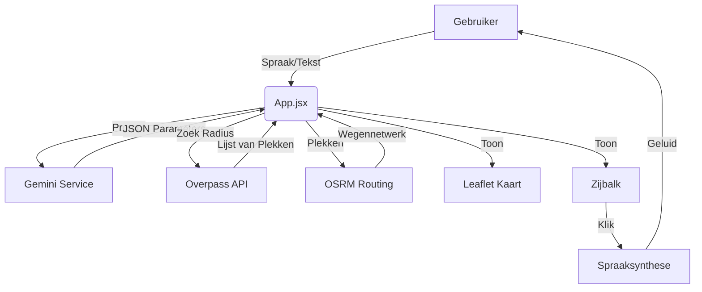

# Technische Module Beschrijving

## 1. Externe Dependencies (Libraries)
Deze applicatie maakt gebruik van diverse open-source bibliotheken om functionaliteit te bieden. Hieronder een overzicht van de belangrijkste keuzes.

### Core Framework
*   **React (v19)**: De basis van de applicatie. We gebruiken functionele componenten en Hooks (`useState`, `useEffect`, `useRef`) voor state management. React 19 is gekozen voor de nieuwste performance updates.
*   **Vite**: De build tool. Zorgt voor razendsnelle opstarttijden tijdens development en geoptimaliseerde bundels voor productie.

### AI & Intelligence
*   **Groq SDK**: Primary engine for high-speed Llama 3 reasoning.
*   **@google/generative-ai**: SDK for Google Gemini (used for complex reasoning).
*   **Tavily**: AI-optimized search engine for gathering real-time POI signals.

### Kaart & Navigatie
*   **MapLibre GL**: Gebruikt voor high-performance vector kaarten en snelle rendering.
*   **Leaflet & React-Leaflet**: De basis voor interactieve kaartlagen en markers.
*   **OSRM**: Open Source Routing Machine voor het berekenen van paden.

### CSS & Styling
*   **Tailwind CSS (v4)**: Utility-first CSS framework.
    *   Zorgt voor consistente styling zonder honderden losse CSS bestanden.
    *   Gebruikt voor de "Glassmorphism" look (transparante panelen) en animaties (`animate-pulse` voor microfoon).

---

## 2. Interne Modules (Source Code)

De broncode is opgedeeld in logische mappen binnen `/src`.

### `/components` (UI Blokken)
Dit zijn de visuele blokken van de app.
*   **`ItinerarySidebar.jsx`**: De meest complexe component. Bevat de logica voor:
    *   De chat-interface (berichten renderen).
    *   De lijst met POI kaarten.
    *   De settings popup.
    *   De settings popup.
    *   Input handling (microfoon knop logica).
    *   **POI Controls**: Bevat de knoppen voor Auto-Audio en het pauzeren van POI updates.
*   **`MapContainer.jsx`**: Beheert de kaartlaag.
    *   Luistert naar updates in `routeData` om pinnen te plaatsen.
    *   Ondersteunt interacties voor "Map Pick" (punten toevoegen via klik).
    *   Tekent de rode/blauwe route lijn (Polyline).
    *   Handelt popups af.
*   **`NavigationOverlay.jsx`**: De "Head-Up Display" (HUD) die over de kaart ligt. Toont de pijlen voor de volgende afslag (komt van OSRM data).
*   **`CitySelector.jsx`**: Het splash-screen (onboarding) waar de gebruiker een stad kiest.
*   **`PoiProposalModal.jsx`**: Toont intelligente suggesties van de AI gids die de gebruiker kan bevestigen of weigeren.
*   **`PoiDetailContent.jsx`**: Verantwoordelijk voor de rijke weergave van POI details (foto's, beschrijvingen).
*   **`ArView.jsx`**: Implementeert Augmented Reality voor het visueel herkennen van bezienswaardigheden via de camera.
*   **`RouteRefiner.jsx`**: De interface om routes aan te passen via Drag & Drop en Map Picking.

### `/services` (Logica & Data)
Hier zit de "hersenen" van de app, gescheiden van de weergave.
*   **`PoiIntelligence.js`**: De motor achter de data-verrijking.
    *   **Multi-Provider**: Schakelt tussen **Groq (Llama 3)** en **Gemini** voor de beste tekstgeneratie.
    *   **Signal Gathering**: Gebruikt **Tavily** voor semantische web-search om de meest recente feitjes te vinden.
    *   **Trust Scoring**: Vergelijkt bronnen (Wikipedia, Foursquare, Search) en geeft aan elke claim een betrouwbaarheidsscore.

### `/utils` (Hulpmiddelen)
*   **`poiService.js`**: Bevat de functies om routes te berekenen.
    *   `calculateRoutePath()`: Roept de OSRM API aan om punten met elkaar te verbinden via de weg.
    *   `getNearbyPOIs()`: Roept de Overpass API (OpenStreetMap) aan om plekken in de buurt te vinden ("vind alle toeristische attracties binnen 500m").
*   **`AutoScroller.js`**: Zorgt dat de zijbalk en de kaart synchroon lopen. Als je op de kaart klikt, scrollt de lijst automatisch naar het juiste kaartje.

### `/netlify/functions` (Backend API)
*   **`groq.js`**: Onze primaire AI-poort voor razendsnelle interacties.
*   **`tavily.js`**: Semantische zoekmachine voor real-time data verrijking.
*   **`foursquare.js`**: Bron voor locatiedata, recensies en foto's.
*   **`poi-cache.js`**: Beheert een gedeelde Redis/Server cache om API kosten te drukken.
*   **`gemini.js`**: Backup/Premium AI provider.
*   **`overpass.js`**: Directe toegang tot OpenStreetMap data.

---

## 3. Data Flow Diagram

