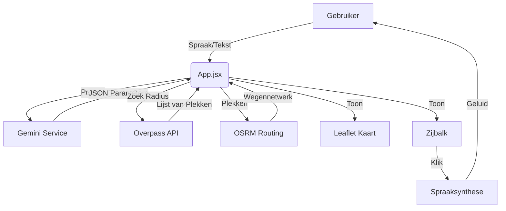

# Technische Module Beschrijving

## 1. Externe Dependencies (Libraries)
Deze applicatie maakt gebruik van diverse open-source bibliotheken om functionaliteit te bieden. Hieronder een overzicht van de belangrijkste keuzes.

### Core Framework
*   **React (v19)**: De basis van de applicatie. We gebruiken functionele componenten en Hooks (`useState`, `useEffect`, `useRef`) voor state management. React 19 is gekozen voor de nieuwste performance updates.
*   **Vite**: De build tool. Zorgt voor razendsnelle opstarttijden tijdens development en geoptimaliseerde bundels voor productie.

### Kaart & Navigatie
*   **Leaflet & React-Leaflet**: De standaard voor interactieve webkaarten. Leaflet is lichtgewicht en mobiel-vriendelijk.
    *   *Waarom geen Google Maps SDK?* Leaflet is gratis, open-source en makkelijker aan te passen qua styling (dark mode). We gebruiken Google alleen voor *data* (search), niet voor *weergave*.

### AI & Intelligence
*   **@google/generative-ai**: De officiële SDK om te communiceren met Google Gemini.
    *   Wordt gebruikt in `netlify/functions/gemini.js` om prompts heen en weer te sturen.

### CSS & Styling
*   **Tailwind CSS (v4)**: Utility-first CSS framework.
    *   Zorgt voor consistente styling zonder honderden losse CSS bestanden.
    *   Gebruikt voor de "Glassmorphism" look (transparante panelen) en animaties (`animate-pulse` voor microfoon).

---

## 2. Interne Modules (Source Code)

De broncode is opgedeeld in logische mappen binnen `/src`.

### `/components` (UI Blokken)
Dit zijn de visuele blokken van de app.
*   **`ItinerarySidebar.jsx`**: De meest complexe component. Bevat de logica voor:
    *   De chat-interface (berichten renderen).
    *   De lijst met POI kaarten.
    *   De settings popup.
    *   Input handling (microfoon knop logica).
*   **`MapContainer.jsx`**: Beheert de kaartlaag.
    *   Luistert naar updates in `routeData` om pinnen te plaatsen.
    *   Tekent de rode/blauwe route lijn (Polyline).
    *   Handelt popups af.
*   **`NavigationOverlay.jsx`**: De "Head-Up Display" (HUD) die over de kaart ligt. Toont de pijlen voor de volgende afslag (komt van OSRM data).

### `/services` (Logica & Data)
Hier zit de "hersenen" van de app, gescheiden van de weergave.
*   **`PoiIntelligence.js`**: Een geavanceerde service klasse.
    *   **Functie**: Zoekt informatie over een plek.
    *   **Werking**: Het ontvangt een naam (bijv. "Gravensteen"). Het start 4 parallelle verzoeken naar: Wikipedia, Google Search, DuckDuckGo en een lokaal archief.
    *   **Score**: Het geeft elk resultaat een "vertrouwensscore". Wikipedia krijgt voorrang.
    *   **Fallback**: Als niets gevonden wordt, vraagt het Gemini om een algemene beschrijving te genereren.

### `/utils` (Hulpmiddelen)
*   **`poiService.js`**: Bevat de functies om routes te berekenen.
    *   `calculateRoutePath()`: Roept de OSRM API aan om punten met elkaar te verbinden via de weg.
    *   `getNearbyPOIs()`: Roept de Overpass API (OpenStreetMap) aan om plekken in de buurt te vinden ("vind alle toeristische attracties binnen 500m").
*   **`AutoScroller.js`**: Zorgt dat de zijbalk en de kaart synchroon lopen. Als je op de kaart klikt, scrollt de lijst automatisch naar het juiste kaartje.

### `/netlify/functions` (Backend API)
Omdat we veilig moeten werken met API keys, draaien deze functies op de server (in de cloud), niet in de browser van de gebruiker.
*   **`gemini.js`**: De poortwachter voor AI verzoeken.
*   **`google-search.js`**: Voert zoekopdrachten uit zonder de API key bloot te geven aan de client.

---

## 3. Data Flow Diagram

