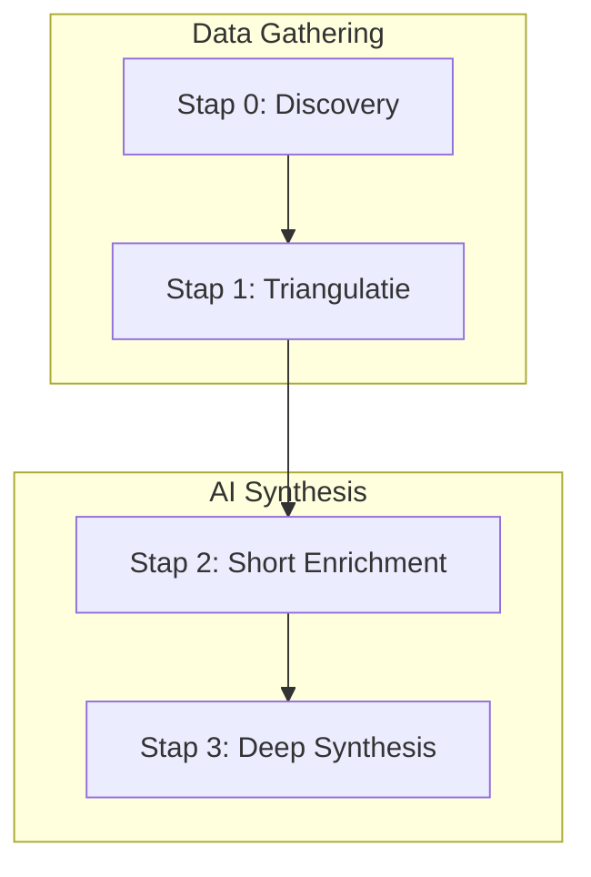

# De Intelligentie van CityExplorer: POI Algoritmes

Dit document beschrijft hoe CityExplorer bezienswaardigheden (Points of Interest - POI's) ontdekt, valideert en verrijkt. We gebruiken een geavanceerde pipeline van 4 stadia.

---

## Stadia van de Pipeline

---

## Stap 0: Ontdekking & Selectie (Discovery)
Wanneer de gebruiker een stad kiest of een vraag stelt, start de zoektocht naar locaties.

1.  **Interest Mapping**: Jouw invoer (bijv. "historische kastelen") wordt vertaald naar **Overpass QL filters**. We zoeken direct in de OpenStreetMap database naar specifieke tags zoals `tourism=attraction` of `historic=castle`.
2.  **Multi-Source Search**: We zoeken tegelijkertijd in:
    *   **OpenStreetMap**: Voor de exacte GPS-coördinaten en basisgegevens.
    *   **Foursquare**: Voor populariteitsdata, foto's en recensies.
    *   **Google Nodes**: Voor globale bekendheid.
3.  **Forbidden Terms Filter**: Om de kwaliteit hoog te houden, filteren we automatisch duizenden "ruis" locaties weg, zoals parkeergarages, kantoren, makelaars en supermarkten (behalve als je er expliciet om vraagt).

---

## Stap 1: Signaal Triangulatie
Voor elke gevonden plek start de `PoiIntelligence` service een onderzoek om te bepalen of de plek echt interessant is en of de data klopt.

**Betrouwbaarheidsscores (Trust Weights):**
We combineren verschillende bronnen, waarbij we elke bron een gewicht geven:
*   **Wikipedia**: 0.9 (Hoogste vertrouwen)
*   **Google Knowledge Graph**: 0.85
*   **Foursquare**: 0.70
*   **Tavily (Semantische Zoekopdracht)**: 0.75

Als Wikipedia iets anders zegt dan een willekeurige website, krijgt Wikipedia voorrang.

---

## Stap 2: Short Enrichment (AI Samenvatting)
Zodra de lijst met plekken geladen is, willen we niet dat je tegen lege kaartjes kijkt.
*   **Groq (Llama 3)** genereert razendsnel korte samenvattingen van 1 à 2 regels.
*   Dit gebeurt in de achtergrond zodat de app soepel blijft aanvoelen.

---

## Stap 3: Deep Synthesis (Het Volledige Verhaal)
Wanneer je op een stop klikt, gaat de AI (Gemini of Groq) de diepte in.
*   Alle verzamelde signalen (van Wikipedia, Tavily en Foursquare) worden samengevoegd.
*   De AI schrijft een uniek, vlot verhaal in jouw taal.
*   **Hoge Zekerheid**: De gids checkt of de feiten kloppen met de gevonden bronnen om "hallucinaties" te voorkomen.

---

## De Route Optimalisatie & "Budget"
CityExplorer lost het "Handelsreizigersprobleem" op voor jouw wandeling.

1.  **Optimalisatie**: Nieuwe plekken worden tussen je bestaande stops geweven door steeds de **dichtstbijzijnde volgende stop** te kiezen (Nearest Neighbor).
2.  **Echte Wegen**: Afstanden worden berekend via het echte wegennetwerk (OSRM), niet in een rechte lijn.
3.  **Tolerantie**: We hanteren een marge van **15%** op je ingestelde limiet. Als een route van 5km toevallig 5.75km wordt omdat er net een prachtig museum op die afstand ligt, wordt de route alsnog goedgekeurd. Is het meer? Dan vraagt de Gids om jouw bevestiging.
